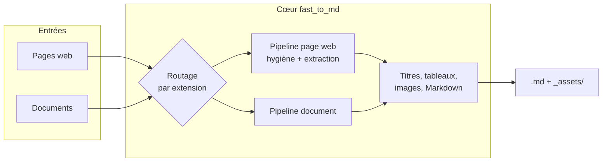

# fast_to_md — version CLI

> Branche **`cli`**. Pour la version avec interface web (Streamlit + Docker Compose), voir la branche [`app`](../../tree/app).

**Convertit n'importe quel document — page web enregistrée, Word, PowerPoint, Excel, PDF, EPUB, e-mail — en Markdown propre, prêt à relire dans un éditeur de notes et à indexer.**


## Formats pris en charge

| Famille | Extensions | Images | Tableaux |
|---|---|---|---|
| Pages web | `.html`, `.htm` | ✅ exportées en fichiers liés | ✅ |
| Documents riches | `.docx` | ✅ exportées en fichiers liés | ✅ |
| Documents texte | `.pptx`, `.xlsx`, `.xls`, `.pdf`, `.epub`, `.msg`, `.csv`, `.ipynb` | ❌ non récupérées | ✅ |

Les images extraites sont écrites dans un dossier `<nom>_assets/` **à côté** du Markdown et référencées en chemin relatif : la note s'ouvre telle quelle dans un éditeur, sans réparer les liens.

Sur la dernière famille, les images embarquées ne sont pas récupérables — la sortie est textuelle. Les liens d'image morts que laisserait cette conversion sont retirés plutôt que livrés cassés.

## Architecture

Un **cœur de conversion** (`src/fast_to_md/`) exposé par la seule CLI `fast2md`. Deux pipelines : les pages web passent par un nettoyage complet (elles sont pleines de chrome à retirer), les documents par un chemin plus court qui rejoint la même fin de traitement.



Détail complet : [docs/ARCHITECTURE.md](docs/ARCHITECTURE.md).

## 1. Installer et configurer SingleFile (capture des pages web)

1. Installer l'extension :
   - Chrome / Edge : [SingleFile sur le Chrome Web Store](https://chromewebstore.google.com/detail/singlefile/mpiodijhokgodhhofbcjdecpffjipkle)
   - Firefox : [SingleFile sur addons.mozilla.org](https://addons.mozilla.org/fr/firefox/addon/single-file/)
2. Dans les options de l'extension (clic droit sur l'icône → *Gérer l'extension* → Options) :

   | Section | Option | État |
   |---|---|---|
   | Contenu HTML | compresser le contenu HTML | ✅ cocher |
   | Contenu HTML | supprimer les éléments cachés | ✅ cocher |
   | Contenu HTML | sauvegarder la page brute | ❌ laisser décoché (sinon les scripts et le DOM non rendu sont gardés) |
   | Contenu HTML | ne pas inclure la date de sauvegarde | ❌ laisser décoché |
   | Feuilles de style | supprimer les styles inutilisés | ✅ cocher |
   | Feuilles de style | supprimer les feuilles de styles pour les appareils autres que des écrans | ✅ cocher |
   | Images | supprimer les images pour des résolutions d'écran alternatives | ✅ cocher |
   | Polices de caractère | supprimer les polices inutilisées / alternatives | ✅ cocher les deux |

   Les scripts sont supprimés par défaut, pas d'option à cocher pour ça.
   → fichiers plus petits et plus propres dès la capture.
3. Sur la page à sauvegarder : clic sur l'icône SingleFile → un fichier `.html` autonome est téléchargé.

> Cette étape ne concerne que les **pages web**. Pour les documents bureautiques (Word, PowerPoint, Excel, PDF, EPUB, e-mails), aucune préparation n'est nécessaire — l'outil les lit directement.

## 2. Installer l'outil

```bash
uv sync --extra docs
```

| Extra | Installe | Nécessaire pour |
|---|---|---|
| *(aucun)* | Cœur de conversion + CLI | Pages web uniquement |
| `docs` | Prise en charge des formats bureautiques | Word, PowerPoint, Excel, PDF, EPUB, e-mails |

## 3. Lancer la conversion

```bash
# Un dossier entier (récursif), sortie dans ./out
uv run fast2md "chemin/vers/documents/" -o out/

# Un seul fichier
uv run fast2md "page.html" -o out/

# Options
uv run fast2md --help
```

Les fichiers `.md` (et leurs dossiers d'images `_assets/`, pour les pages web et les documents Word) sont créés dans le dossier de sortie, en conservant l'arborescence d'entrée.

**Nommage des fichiers** : pour une page web, `<source>_<Titre_De_L_Article>.md` — la source (nom du site, en snake_case) est déduite du `<title>` de la page ou de l'URL inscrite par SingleFile dans le fichier. Pour un document, le nom de fichier d'origine. Exemples :

```text
machine_learning_mastery_Essence_of_Bootstrap_Aggregation_Ensembles.md
kdnuggets_Feature_Stores_from_Scratch_A_Minimal_Working_Implementation.md
Rapport_de_synthese_2026.md
```

En cas de doublon dans un même lot, un suffixe `_2`, `_3`... est ajouté.

Sortie type :

```text
  page1.html      →  page1.md            (article, 34696 car., 11 img)
? page2.html      →  page2.md            (readability, 615 car., 0 img) [ratio faible (615/59697)]
  rapport.docx    →  rapport.md          (docx, 4200 car., 3 img)

3 fichier(s) traité(s) — 2 ok, 1 à vérifier, 0 en erreur.
```

La colonne entre parenthèses indique la **stratégie de conversion** utilisée : `article`/`main` (conteneur sémantique), `readability` (extraction générique), `body` (dernier recours), `docx` (document riche), `doc:<extension>` (document texte), ou le nom d'un profil personnalisé.

## Si un site donne de mauvais résultats

Le mode générique couvre la plupart des pages. Si un site précis ressort systématiquement en `?` (ratio faible) ou avec du bruit résiduel, on peut lui dédier un **profil** dans [config/selectors.yaml](config/selectors.yaml) :

```yaml
profiles:
  monsite:
    detect: ".article-reader"        # si ce sélecteur matche, le profil s'applique
    content: ".article-reader main"  # ce qu'on garde
    strip:                           # (optionnel) à supprimer DANS le contenu gardé
      - ".newsletter-banner"
```

Pour trouver les bons sélecteurs : ouvrir la capture dans un navigateur, inspecter le conteneur de l'article (F12), repérer sa classe ou son id stable. Les profils ont priorité sur le mode générique. Ils ne s'appliquent qu'aux pages web — les documents bureautiques n'en ont pas besoin.

## Tests

```bash
uv run pytest
```

**66 tests** couvrent le pipeline et la CLI. Les documents Word et PowerPoint sont fabriqués à la volée plutôt que versionnés. Détail par fichier : [docs/ARCHITECTURE.md §8](docs/ARCHITECTURE.md#8-tests).

## Structure du projet

```text
src/fast_to_md/
├── cli.py             # commande fast2md
├── sources.py         # routage par extension, préparation des documents
├── core.py            # orchestration : aiguillage, pipeline, statut
├── hygiene.py         # nettoyage du bruit des pages web
├── extract.py         # isolation du contenu utile (cascade de stratégies)
├── maths.py           # récupération des formules en LaTeX
├── convert.py         # Markdown, images, tableaux, titres
└── naming.py          # nommage des sorties et collisions
tests/                  # 66 tests + fixtures HTML
config/selectors.yaml   # profils d'extraction par site (vide par défaut)
```

## Documentation

| Document | Contenu |
|---|---|
| [docs/CADRAGE.md](docs/CADRAGE.md) | Le **pourquoi** : pitch, périmètre, hypothèses, décisions produit |
| [docs/ARCHITECTURE.md](docs/ARCHITECTURE.md) | Le **comment** : modules, formats, pipelines, stratégie d'extraction, tests, décisions techniques |

## Licences & composants

| Composant | Rôle | Licence usuelle |
|---|---|---|
| Python | Langage / runtime | PSF |
| uv | Gestion des dépendances (`uv.lock` versionné) | MIT |
| beautifulsoup4 | Parsing HTML | MIT |
| lxml | Parseur / nettoyage HTML | BSD-3-Clause |
| readability-lxml | Extraction générique du contenu (pages web) | Apache-2.0 |
| markdownify | Conversion HTML → Markdown | MIT |
| mammoth | Conversion Word (.docx) → HTML | MIT |
| MarkItDown | Conversion PowerPoint, Excel, PDF, EPUB, e-mails, CSV, carnets de notes → Markdown | MIT |
| PyYAML | Lecture des profils d'extraction | MIT |
| pytest | Suite de tests | MIT |
| **Ce projet** | Code applicatif | MIT — Copyright (c) 2026 floSa — `<à confirmer>` : aucun fichier `LICENSE` ni champ `license` dans `pyproject.toml` |

> Liste versionnée complète (avec transitives) dans [`pyproject.toml`](pyproject.toml) et [`uv.lock`](uv.lock).

> **Attention** : licences indiquées d'après l'usage courant de ces briques ; elles **changent parfois selon les versions**. À vérifier avant tout usage engageant.

## Limites connues

| Aspect | Limitation | Piste |
|---|---|---|
| Images des documents texte | Non récupérées (PDF, PowerPoint, Excel, EPUB) | Chaîne dédiée par format si le besoin se confirme |
| PDF complexes | Mise en page multi-colonnes et tableaux denses mal restitués | Comparer avec une chaîne à analyse de mise en page |
| Formats `.xls` et `.msg` | Annoncés, dépendances vérifiées, mais sans test de conversion réelle | Ajouter une fixture si ces formats deviennent courants |
| Traitement par lot | Séquentiel, pas de parallélisation | À paralléliser si le volume le justifie |

Liste complète : [docs/ARCHITECTURE.md §10](docs/ARCHITECTURE.md#10-limites-connues--pistes).
