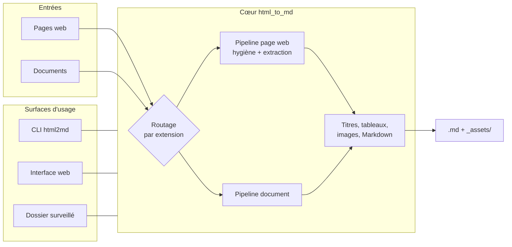

# html_to_md — version app (interface web)

> Branche **`app`**. Pour la version ligne de commande, voir la branche [`cli`](../../tree/cli). Présentation générale sur [`main`](../../tree/main).

**Convertit n'importe quel document — page web enregistrée, Word, PowerPoint, Excel, PDF, EPUB, e-mail — en Markdown propre, prêt à relire dans un éditeur de notes et à indexer.**


## Formats pris en charge

| Famille | Extensions | Images | Tableaux |
|---|---|---|---|
| Pages web | `.html`, `.htm` | ✅ exportées en fichiers liés | ✅ |
| Documents riches | `.docx` | ✅ exportées en fichiers liés | ✅ |
| Documents texte | `.pptx`, `.xlsx`, `.xls`, `.pdf`, `.epub`, `.msg`, `.csv`, `.ipynb` | ❌ non récupérées | ✅ |

Les images extraites sont écrites dans un dossier `<nom>_assets/` **à côté** du Markdown et référencées en chemin relatif : la note s'ouvre telle quelle dans un éditeur, sans réparer les liens.

Sur la dernière famille, les images embarquées ne sont pas récupérables — la sortie est textuelle. Les liens d'image morts que laisserait cette conversion sont retirés plutôt que livrés cassés.

## Architecture

- Un **cœur de conversion** (`src/html_to_md/`) sans dépendance à une interface, exposé par la CLI `html2md`.
- Une **couche application** (`app/`) : interface web Streamlit + service de surveillance de dossier.
- Deux **pipelines** : les pages web passent par un nettoyage complet (elles sont pleines de chrome à retirer), les documents par un chemin plus court qui rejoint la même fin de traitement.



Détail complet : [docs/ARCHITECTURE.md](docs/ARCHITECTURE.md).

## Ce que fait l'app

- **Déposer des documents** : glisser-déposer un ou plusieurs fichiers, conversion, puis téléchargement du `.md` (ou d'un `.zip` Markdown + images si plusieurs fichiers). Un document illisible ressort en erreur sans faire échouer les autres.
- **Dossier serveur** : convertir tout un dossier accessible par l'app, **récursivement**, avec barre d'avancement et téléchargement en `.zip`.
- **Dossier surveillé** : tout document déposé dans `HTML2MD/HTMLs` est converti automatiquement vers `HTML2MD/MDs`. Le service `watcher` scrute le dossier **au démarrage puis toutes les heures** et ne retraite que les fichiers nouveaux ou modifiés (registre `HTML2MD/.processed.json`). L'onglet permet aussi de lancer une conversion immédiate.

> Le nom du dossier `HTMLs/` est historique : il accepte désormais tous les formats.

## Démarrage avec Docker (recommandé)

```bash
docker compose up --build
```

Puis ouvrir **http://localhost:8505**.

Deux services sont lancés :

| Service | Image / Build | Port interne | Port hôte | Rôle |
|---|---|---|---|---|
| `webapp` | build `.` → `html_to_md` | `8501` | `8505` | Interface Streamlit |
| `watcher` | build `.` → `html_to_md` | — | — | Conversion automatique du dossier surveillé |

Les deux partagent le volume `./HTML2MD` (sous-dossiers `HTMLs/` et `MDs/`). Déposez vos documents dans `HTML2MD/HTMLs`, récupérez les `.md` dans `HTML2MD/MDs`.

## Démarrage sans Docker

```bash
uv sync --extra app --extra docs
```

```bash
uv run streamlit run app/streamlit_app.py
```

Service de surveillance, dans un autre terminal (optionnel) :

```bash
PYTHONPATH=app uv run python app/watcher.py
```

| Extra | Installe | Nécessaire pour |
|---|---|---|
| *(aucun)* | Cœur de conversion + CLI | Pages web uniquement |
| `app` | Interface web Streamlit | Onglets et téléchargements |
| `docs` | Prise en charge des formats bureautiques | Word, PowerPoint, Excel, PDF, EPUB, e-mails |

## Configuration

| Variable | Défaut | Effet |
|---|---|---|
| `HTML2MD_ROOT` | `/app/HTML2MD` | Racine des dossiers `HTMLs`/`MDs` |
| `WATCH_INTERVAL_SECONDS` | `3600` | Période de scan du watcher, en secondes |

## Interface en ligne de commande

Le cœur est aussi exposé par la commande `html2md` (point d'entrée [`html_to_md.cli:main`](src/html_to_md/cli.py)) :

```bash
uv run html2md INPUT -o OUTPUT
```

| Argument | Défaut | Rôle |
|---|---|---|
| `input` | — (requis) | Fichier ou dossier traité **récursivement** |
| `-o`, `--output` | `./out` | Dossier de sortie (l'arborescence d'entrée est reproduite) |
| `--config` | `config/selectors.yaml` | YAML des profils d'extraction par site |
| `--min-image-bytes` | `4096` | Taille minimale (octets) pour exporter une image. **Ne s'applique qu'aux pages web**, dont il écarte les icônes d'interface |

Chaque fichier est marqué `ok`, `à vérifier` (contenu peut-être sur-nettoyé) ou `erreur` ; la commande renvoie le **code de sortie 1** s'il y a au moins une erreur, `0` sinon. Un fichier corrompu n'interrompt pas le lot.

## Tests

```bash
uv run pytest
```

**74 tests** couvrent les deux pipelines, la CLI et l'interface. Les documents Word et PowerPoint sont fabriqués à la volée plutôt que versionnés. Détail par fichier : [docs/ARCHITECTURE.md §10](docs/ARCHITECTURE.md#10-tests).

## Structure du projet

```text
app/
├── streamlit_app.py   # interface web (3 onglets)
├── conversion.py      # adaptateurs cœur disque → mémoire (upload, zip)
└── watcher.py         # surveillance horaire du dossier surveillé
src/html_to_md/
├── cli.py             # commande html2md
├── sources.py         # routage par extension, préparation des documents
├── core.py            # orchestration : aiguillage, pipeline, statut
├── hygiene.py         # nettoyage du bruit des pages web
├── extract.py         # isolation du contenu utile (cascade de stratégies)
├── maths.py           # récupération des formules en LaTeX
├── convert.py         # Markdown, images, tableaux, titres
└── naming.py          # nommage des sorties et collisions
tests/                 # 74 tests + fixtures HTML
config/selectors.yaml  # profils d'extraction par site (vide par défaut)
HTML2MD/
├── HTMLs/             # déposer ici les documents
└── MDs/               # le Markdown converti apparaît ici
Dockerfile
docker-compose.yml
```

## Documentation

| Document | Contenu |
|---|---|
| [docs/CADRAGE.md](docs/CADRAGE.md) | Le **pourquoi** : pitch, périmètre, hypothèses, décisions produit |
| [docs/ARCHITECTURE.md](docs/ARCHITECTURE.md) | Le **comment** : modules, formats, pipelines, stratégie d'extraction, tests, décisions techniques |

## Licences & composants

| Composant | Rôle | Licence usuelle |
|---|---|---|
| Python | Langage / runtime (`python:3.12-slim`) | PSF |
| uv | Gestion des dépendances (`uv.lock` versionné) | MIT |
| Streamlit | Interface web (extra `app`) | Apache-2.0 |
| Docker Compose | Orchestration des deux services | Apache-2.0 |
| pytest | Suite de tests | MIT |
| **Ce projet** | Code applicatif | MIT — Copyright (c) 2026 floSa — `<à confirmer>` : aucun fichier `LICENSE` ni champ `license` dans `pyproject.toml` |

> Les briques de conversion ne sont pas détaillées ici. La liste complète et versionnée des dépendances se lit dans [`pyproject.toml`](pyproject.toml) et [`uv.lock`](uv.lock), qui font foi pour toute vérification de licence.

> **Attention** : licences indiquées d'après l'usage courant de ces briques ; elles **changent parfois selon les versions**. À vérifier avant tout usage engageant.

## Limites connues

| Aspect | Limitation | Piste |
|---|---|---|
| Images des documents texte | Non récupérées (PDF, PowerPoint, Excel, EPUB) | Chaîne dédiée par format si le besoin se confirme |
| PDF complexes | Mise en page multi-colonnes et tableaux denses mal restitués | Comparer avec une chaîne à analyse de mise en page |
| Formats `.xls` et `.msg` | Annoncés, dépendances vérifiées, mais sans test de conversion réelle | Ajouter une fixture si ces formats deviennent courants |
| Poids de l'image Docker | **717 Mo** avec les formats bureautiques | Image allégée si seul le HTML est utilisé |
| Onglet « dossier serveur » | Convertit tout chemin lisible par l'app | À restreindre en cas d'exposition partagée |

Liste complète : [docs/ARCHITECTURE.md §11](docs/ARCHITECTURE.md#11-limites-connues--pistes).
