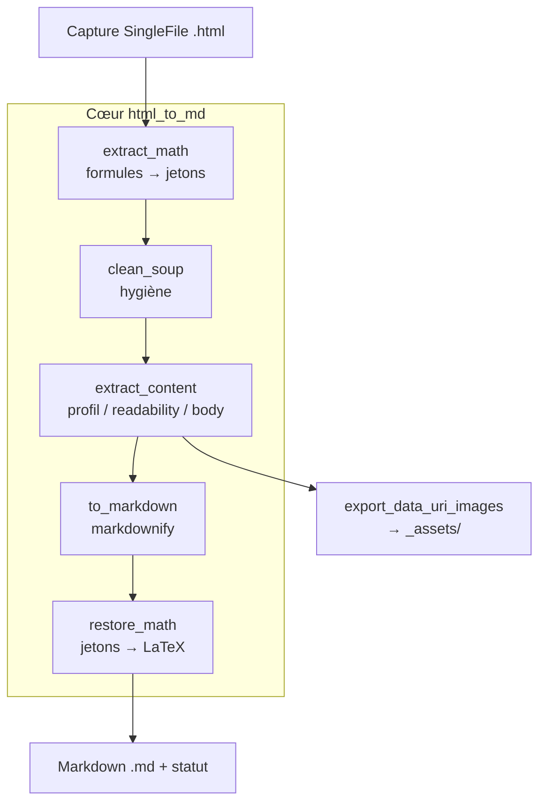

# Architecture — html_to_md

> Le **COMMENT**. Le POURQUOI (objectifs, hypothèses, décisions produit) est dans
> [CADRAGE.md](CADRAGE.md).

## 1. Vue d'ensemble

`html_to_md` transforme des captures de pages web au format **SingleFile**
(l'extension Chrome/Firefox qui fige une page entière, styles et images data-URI
compris, dans un unique `.html`) en **Markdown propre** destiné à l'ingestion RAG.

Le projet se décompose en deux couches nettement séparées :

- un **cœur de conversion** pur (`src/html_to_md/`, src-layout), sans dépendance à
  une interface, exposé par une **CLI** (`html2md`) ;
- une **couche application** (`app/`, présente sur la branche `app`) qui enveloppe ce
  cœur dans une interface web **Streamlit** et un service de surveillance de dossier,
  le tout orchestré par **Docker Compose**.

Le même cœur alimente donc la CLI, l'UI web et le watcher : la conversion est écrite
une seule fois.

> Archétype : **appli/agent** (une application dominante, src-layout, un cœur métier).
> Le projet a aussi une facette « multi-services Docker » (deux services `compose`),
> mais ces services partagent **la même image** et le même volume ; il s'agit d'une
> application unique et de son processus compagnon, pas d'une constellation de
> services hétérogènes.

---

## 2. Composants

### 2.1 Cœur de conversion — `src/html_to_md/`

| Module | Rôle |
|---|---|
| [`cli.py`](../src/html_to_md/cli.py) | Point d'entrée CLI `html2md` : parcours des sources, appel du cœur, rapport ligne à ligne, code de sortie |
| [`core.py`](../src/html_to_md/core.py) | Orchestration d'un fichier : hygiène → extraction → Markdown ; produit un `Result` |
| [`hygiene.py`](../src/html_to_md/hygiene.py) | Passe d'hygiène conservatrice : retire scripts, styles, chrome de navigation, éléments cachés |
| [`extract.py`](../src/html_to_md/extract.py) | Isolation du contenu utile : profils par site → conteneurs sémantiques → `readability` → `<body>` |
| [`maths.py`](../src/html_to_md/maths.py) | Récupération de la source LaTeX des formules rendues (KaTeX, MathJax v2/v3, MathML) |
| [`convert.py`](../src/html_to_md/convert.py) | Conversion HTML→Markdown (`markdownify`) et export des images data-URI |
| [`naming.py`](../src/html_to_md/naming.py) | Nommage des fichiers de sortie `<site>_<Titre_Article>.md` |

### 2.2 Couche application — `app/` (branche `app`)

| Module | Rôle |
|---|---|
| [`streamlit_app.py`](../app/streamlit_app.py) | Interface web à 3 onglets : dépôt de fichiers, dossier serveur, dossier surveillé |
| [`conversion.py`](../app/conversion.py) | Adaptateurs disque ↔ mémoire : le cœur écrit sur disque (dossier temporaire), l'app relit en mémoire pour proposer un téléchargement `.md` ou `.zip` |
| [`watcher.py`](../app/watcher.py) | Service de surveillance : convertit périodiquement les nouveaux `.html` du dossier surveillé |

### 2.3 Services Docker Compose

| Service | Image / Build | Port interne | Port hôte | Rôle |
|---|---|---|---|---|
| `webapp` | build `.` → `html_to_md` | `8501` | `8505` | Interface Streamlit |
| `watcher` | build `.` → `html_to_md` (commande `python app/watcher.py`) | — | — | Conversion automatique du dossier surveillé |

Source : [`docker-compose.yml`](../docker-compose.yml), [`Dockerfile`](../Dockerfile).

---

## 3. Stack technologique

| Couche | Technologie | Version (contrainte) |
|---|---|---|
| Langage | Python | `>=3.10` (image Docker : `python:3.12-slim`) |
| Parsing HTML | beautifulsoup4 | `>=4.12` |
| Parseur / nettoyage | lxml (`[html_clean]`) | `>=5.0` |
| Extraction générique | readability-lxml | `>=0.8` |
| HTML → Markdown | markdownify | `>=0.13` |
| Config des profils | PyYAML | `>=6.0` |
| Interface web (extra `app`) | Streamlit | `>=1.36` |

Source : [`pyproject.toml`](../pyproject.toml). Streamlit est une dépendance
**optionnelle** (`pip install ".[app]"`) : le cœur et la CLI n'en ont pas besoin.

---

## 4. Flux de bout en bout (pipeline de conversion)

`process_file` ([core.py](../src/html_to_md/core.py)) enchaîne, pour chaque fichier :

1. **Lecture** du HTML brut (`utf-8`, erreurs remplacées) et mesure du texte visible
   (`chars_in`).
2. **Extraction des formules** *avant* l'hygiène — car la passe d'hygiène supprime les
   `<script>` et `<svg>` où la source LaTeX est stockée. Chaque formule est remplacée
   par un jeton `ZZMATHTOKEN<n>ZZ` qui traverse la conversion sans être échappé.
3. **Hygiène** ([hygiene.py](../src/html_to_md/hygiene.py)) : suppression du bruit non
   ambigu (scripts, styles, `nav`/`aside`, `header`/`footer` hors article, éléments
   cachés, widgets « articles liés », commentaires).
4. **Extraction du contenu utile** ([extract.py](../src/html_to_md/extract.py)) selon
   une cascade de stratégies (voir §5).
5. **Nettoyage post-extraction** : suppression des sélecteurs `strip` du profil,
   `tidy_headings` (retrait des ancres `#`/`¶` dans les titres).
6. **Nommage** ([naming.py](../src/html_to_md/naming.py)) : `<site>_<Titre_Article>.md`,
   avec gestion des collisions via l'ensemble partagé `taken`.
7. **Export des images** data-URI ≥ `min_image_bytes` vers `<nom>_assets/` ; les images
   plus petites (icônes d'UI) sont supprimées.
8. **Conversion Markdown** ([convert.py](../src/html_to_md/convert.py)) : `markdownify`
   configuré en titres **ATX**, puces `-`, langage des blocs de code repris de
   `data-code-language`.
9. **Restauration des formules** : les jetons redeviennent `$...$` (inline) ou `$$...$$`
   (bloc).
10. **Garantie d'un titre** : si aucun `# ` n'a survécu, on préfixe avec le titre
    d'article du `<title>`.
11. **Écriture** du `.md` et calcul du **statut qualité** (voir §6).

---

## 5. Stratégie d'extraction (cascade)

L'isolation du contenu utile suit une cascade, du plus spécifique au plus robuste.
Un candidat n'est retenu que s'il conserve au moins **`MIN_CONTENT_CHARS` = 200**
caractères de texte.

| Ordre | Stratégie | Déclenchement |
|---|---|---|
| 1 | **Profil par site** (`config/selectors.yaml`) | Le sélecteur `detect` du profil matche ; on garde son `content` |
| 2 | **Conteneur sémantique HTML5** | Premier de `article`, `main`, `[role=main]` (`GENERIC_SELECTORS`) |
| 3 | **readability-lxml** | Extraction générique sur le HTML déjà nettoyé |
| 4 | **`<body>` brut** | Dernier recours si tout le reste échoue |

Entre le conteneur sémantique (2) et `readability` (3), le candidat qui **conserve le
plus de texte** l'emporte : le Markdown le plus complet est jugé le moins risqué pour
l'ingestion.

**Constantes de réglage :**

| Constante | Valeur | Fichier | Effet |
|---|---|---|---|
| `MIN_CONTENT_CHARS` | `200` | extract.py | Seuil minimal pour valider une extraction |
| `MIN_IMAGE_BYTES` | `4096` | convert.py | En dessous, une image data-URI est jugée icône d'UI et supprimée |
| `WARN_RATIO` | `0.30` | core.py | Sous ce ratio texte-sortie / texte-entrée, fichier signalé « à vérifier » |
| `MIN_OUTPUT_CHARS` | `200` | core.py | Sortie plus courte → fichier signalé « à vérifier » |

---

## 6. Statut qualité d'une conversion

Chaque fichier produit un `Result` avec un `status` :

| Statut | Condition | Signification |
|---|---|---|
| `ok` | Sortie ≥ 200 car. et ratio ≥ 0,30 | Conversion jugée fiable |
| `review` | Sortie < 200 car. **ou** ratio < 0,30 | Le nettoyage a peut-être retiré trop de contenu |
| `error` | Exception pendant le traitement | Fichier illisible / corrompu (n'interrompt pas le lot) |

La CLI renvoie le **code de sortie 1** s'il y a au moins une erreur, `0` sinon.

---

## 7. Récupération des formules mathématiques

Les moteurs de rendu web conservent presque toujours la source LaTeX dans le DOM.
`extract_math` la récupère selon le moteur, avant l'hygiène :

| Moteur | Source LaTeX récupérée |
|---|---|
| MathJax v2 | `<script type="math/tex[; mode=display]">` |
| KaTeX | `<annotation encoding="application/x-tex">` dans `.katex-mathml` |
| MathJax v3 | `<mjx-container>` (annotation, `aria-label`, ou texte) |
| MathML natif | `<math>` (annotation éventuelle) |

Le mode bloc/inline est déduit du conteneur (`.katex-display`, `display="true"`,
`mode=display`, `display="block"`).

---

## 8. Persistance & volumes (version app)

| Chemin (dans le conteneur) | Monté depuis | Contenu |
|---|---|---|
| `/app/HTML2MD` | `./HTML2MD` (volume Compose) | Dossiers d'échange du watcher |
| `HTML2MD/HTMLs/` | — | Captures `.html` à convertir (déposées par l'utilisateur) |
| `HTML2MD/MDs/` | — | Markdown produit |
| `HTML2MD/.processed.json` | — | Registre du watcher : `chemin → mtime_ns:taille` |

Le watcher ([watcher.py](../app/watcher.py)) scrute `HTMLs/` au démarrage puis toutes
les `WATCH_INTERVAL_SECONDS` (défaut **3600 s**). Un fichier n'est reconverti que si sa
signature `mtime_ns:taille` diffère de celle du registre — pas de retraitement à vide.
Les noms déjà présents dans `MDs/` sont réservés pour ne pas écraser une conversion
passée.

---

## 9. Décisions d'architecture

- **Séparation cœur / interface** : le cœur (`src/html_to_md/`) ne connaît que le
  disque et n'importe aucune brique d'UI, **plutôt que** de mêler conversion et
  Streamlit, **parce que** la même logique doit servir la CLI, l'UI et le watcher sans
  duplication. *Limite* : la couche app doit faire transiter les octets par un dossier
  temporaire (le cœur écrit sur disque) — voir [conversion.py](../app/conversion.py).

- **Extraction en cascade avec repli** : profils → sémantique → readability → `<body>`,
  **plutôt que** de dépendre uniquement de `readability`, **parce que** `readability`
  peut tronquer et qu'un conteneur sémantique garde parfois plus de contenu. *Limite* :
  choisir « le plus de texte » peut laisser passer du bruit résiduel.

- **Formules extraites avant l'hygiène** : tokenisation LaTeX **avant** de supprimer
  `<script>`/`<svg>`, **parce que** ces balises portent la source LaTeX. *Limite* :
  couplage à la structure DOM propre à chaque moteur de rendu (KaTeX/MathJax/MathML).

- **Watcher = processus séparé** : service Compose distinct **plutôt que** thread interne
  à Streamlit, **parce que** la surveillance doit vivre indépendamment de l'UI (et
  survivre à l'absence de session web). *Limite* : deux conteneurs pour la même image.

- **Registre par signature `mtime+taille`** **plutôt que** hachage du contenu, **parce
  que** c'est suffisant et bien moins coûteux pour détecter les changements. *Limite* :
  une modification qui préserve mtime et taille passerait inaperçue.

---

## 10. Limites connues & pistes

| Aspect | Limitation / état | Piste |
|---|---|---|
| Tests | Le dossier `tests/` ne contient que des **fixtures** (`sample_math.html`, `sample_singlefile.html`), aucun `test_*.py` visible | Ajouter des tests unitaires exerçant le pipeline sur les fixtures |
| Formats d'entrée | Conçu pour des captures **SingleFile** ; un HTML arbitraire peut mal se nettoyer | `<à confirmer>` : périmètre volontairement restreint |
| Profils par site | `config/selectors.yaml` est **vide par défaut** (mode générique) | Ajouter des profils pour les sites récalcitrants |
| Détection changement watcher | Signature `mtime_ns:taille` uniquement | Hachage du contenu si besoin de robustesse |
| Sécurité du dossier serveur | L'onglet « dossier serveur » convertit tout chemin lisible par l'app | `<à confirmer>` : à restreindre si exposition multi-utilisateurs |
