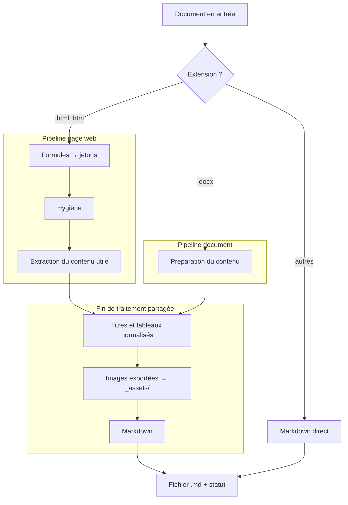

# Architecture — fast_to_md

> Le **COMMENT**. Le POURQUOI (objectifs, hypothèses, décisions produit) est dans
> [CADRAGE.md](CADRAGE.md).

## 1. Vue d'ensemble

`fast_to_md` transforme des documents en **Markdown propre**, relisible dans un
éditeur de notes et exploitable pour l'ingestion RAG. Il accepte deux familles
d'entrées, traitées différemment :

- des **captures de pages web** (`.html`), typiquement produites par l'extension
  **SingleFile**, qui fige une page entière — styles et images comprises — dans un
  fichier unique ;
- des **documents bureautiques** (Word, PowerPoint, Excel, PDF, EPUB, e-mails,
  carnets de notes, CSV).

Le projet est un **cœur de conversion pur** (`src/fast_to_md/`, src-layout), exposé
par une seule surface : la **CLI** `fast2md`. Cette branche n'embarque ni interface
web ni service de surveillance de dossier — c'est la version « ligne de commande
seule » du projet ; voir la branche `app` pour l'équivalent avec interface Streamlit
et Docker Compose.

> Archétype : **appli/agent** (une application dominante, src-layout, un seul point
> d'entrée).

---

## 2. Composants

| Module | Rôle |
|---|---|
| [`cli.py`](../src/fast_to_md/cli.py) | Point d'entrée CLI `fast2md` : parcours des sources, appel du cœur, rapport ligne à ligne, code de sortie |
| [`sources.py`](../src/fast_to_md/sources.py) | Routage par extension : décide du chemin de conversion et prépare les documents non-HTML |
| [`core.py`](../src/fast_to_md/core.py) | Orchestration d'un fichier : aiguillage, pipeline, écriture ; produit un `Result` |
| [`hygiene.py`](../src/fast_to_md/hygiene.py) | Passe d'hygiène conservatrice : retire scripts, styles, chrome de navigation, éléments cachés |
| [`extract.py`](../src/fast_to_md/extract.py) | Isolation du contenu utile d'une page web : profils par site → conteneurs sémantiques → heuristique générique → `<body>` |
| [`maths.py`](../src/fast_to_md/maths.py) | Récupération de la source LaTeX des formules rendues (KaTeX, MathJax v2/v3, MathML) |
| [`convert.py`](../src/fast_to_md/convert.py) | Production du Markdown, export des images embarquées, normalisation des tableaux et des titres |
| [`naming.py`](../src/fast_to_md/naming.py) | Nommage des fichiers de sortie et gestion des collisions |

---

## 3. Formats pris en charge

Le format d'entrée est déterminé par l'**extension** du fichier
([`sources.py`](../src/fast_to_md/sources.py)), qui décide du chemin suivi. Trois
familles, trois niveaux de restitution :

| Famille | Extensions | Images | Tableaux | Chemin |
|---|---|---|---|---|
| Pages web | `.html`, `.htm` | ✅ exportées en fichiers liés | ✅ | Pipeline complet (§4) |
| Documents riches | `.docx` | ✅ exportées en fichiers liés | ✅ | Pipeline document, via HTML intermédiaire |
| Documents texte | `.pptx`, `.xlsx`, `.xls`, `.pdf`, `.epub`, `.msg`, `.csv`, `.ipynb` | ❌ non récupérées | ✅ | Pipeline document, Markdown direct |

Sur la dernière famille, les images embarquées ne sont **pas** récupérables : la
sortie est textuelle. C'est assumé — ces formats sont un filet de sécurité, pas le
cœur de l'outil. Les liens d'image morts que laisserait cette conversion sont
retirés du Markdown final plutôt que livrés cassés.

> La liste des formats est tenue honnête par un test dédié
> ([`tests/test_formats.py`](../tests/test_formats.py)) : ajouter une extension à la
> liste sans la tester fait échouer la suite.

---

## 4. Flux de bout en bout

`process_file` ([core.py](../src/fast_to_md/core.py)) aiguille d'abord selon la
famille du fichier, puis déroule le pipeline correspondant.



### 4.1 Pipeline page web

1. **Lecture** du HTML brut (`utf-8`, erreurs remplacées) et mesure du texte visible
   (`chars_in`).
2. **Extraction des formules** *avant* l'hygiène — car la passe d'hygiène supprime les
   `<script>` et `<svg>` où la source LaTeX est stockée. Chaque formule est remplacée
   par un jeton `ZZMATHTOKEN<n>ZZ` qui traverse la conversion sans être échappé.
3. **Hygiène** ([hygiene.py](../src/fast_to_md/hygiene.py)) : suppression du bruit non
   ambigu (scripts, styles, `nav`/`aside`, `header`/`footer` hors article, éléments
   cachés, widgets « articles liés », commentaires).
4. **Extraction du contenu utile** ([extract.py](../src/fast_to_md/extract.py)) selon
   une cascade de stratégies (voir §5).
5. **Nettoyage post-extraction** : suppression des sélecteurs `strip` du profil,
   retrait des ancres `#`/`¶` dans les titres, promotion des en-têtes de tableaux.
6. **Nommage** ([naming.py](../src/fast_to_md/naming.py)) : `<site>_<Titre_Article>.md`,
   avec gestion des collisions via l'ensemble partagé `taken`.
7. **Export des images** embarquées ≥ `min_image_bytes` vers `<nom>_assets/` ; les
   images plus petites (icônes d'interface) sont supprimées.
8. **Conversion Markdown** : titres **ATX**, puces `-`, langage des blocs de code
   repris de `data-code-language`.
9. **Restauration des formules** : les jetons redeviennent `$...$` (inline) ou `$$...$$`
   (bloc).
10. **Garantie d'un titre** : si aucun `# ` n'a survécu, on préfixe avec le titre
    d'article du `<title>`.
11. **Écriture** du `.md` et calcul du **statut qualité** (voir §6).

### 4.2 Pipeline document

Plus court, et volontairement : un document bureautique ne contient **pas de chrome
de page**. L'hygiène et l'extraction du contenu principal y sont sautées — elles ne
feraient que risquer de supprimer du contenu légitime.

1. **Préparation** du contenu ([sources.py](../src/fast_to_md/sources.py)) : les
   documents riches passent par un HTML intermédiaire qui conserve images et
   tableaux ; les autres produisent directement du Markdown.
2. **Nommage** d'après le nom du fichier source.
3. **Normalisation** des titres et des en-têtes de tableaux (documents riches).
4. **Export des images** vers `<nom>_assets/`, **sans seuil de taille** : contrairement
   à une page web, un document n'a pas d'icônes d'interface — la moindre vignette y
   est du contenu (schéma, logo, capture).
5. **Garantie d'un titre** repris du nom de fichier si le document n'en porte pas.
6. **Écriture** et statut : pas de contrôle de ratio ici (rien n'a été retiré), seule
   une sortie quasi vide est signalée.

---

## 5. Stratégie d'extraction des pages web (cascade)

L'isolation du contenu utile suit une cascade, du plus spécifique au plus robuste.
Un candidat n'est retenu que s'il conserve au moins **`MIN_CONTENT_CHARS` = 200**
caractères de texte.

| Ordre | Stratégie | Déclenchement |
|---|---|---|
| 1 | **Profil par site** (`config/selectors.yaml`) | Le sélecteur `detect` du profil matche ; on garde son `content` |
| 2 | **Conteneur sémantique HTML5** | Premier de `article`, `main`, `[role=main]` (`GENERIC_SELECTORS`) |
| 3 | **Heuristique générique** (type « mode lecture ») | Extraction sur le HTML déjà nettoyé |
| 4 | **`<body>` brut** | Dernier recours si tout le reste échoue |

Entre le conteneur sémantique (2) et l'heuristique générique (3), le candidat qui
**conserve le plus de texte** l'emporte : le Markdown le plus complet est jugé le
moins risqué pour l'ingestion.

**Constantes de réglage :**

| Constante | Valeur | Fichier | Effet |
|---|---|---|---|
| `MIN_CONTENT_CHARS` | `200` | extract.py | Seuil minimal pour valider une extraction |
| `MIN_IMAGE_BYTES` | `4096` | convert.py | En dessous, une image de page web est jugée icône d'interface et supprimée. **Ne s'applique pas aux documents** |
| `WARN_RATIO` | `0.30` | core.py | Sous ce ratio texte-sortie / texte-entrée, page web signalée « à vérifier » |
| `MIN_OUTPUT_CHARS` | `200` | core.py | Sortie plus courte → fichier signalé « à vérifier » |

---

## 6. Statut qualité d'une conversion

Chaque fichier produit un `Result` avec un `status` :

| Statut | Condition | Signification |
|---|---|---|
| `ok` | Sortie ≥ 200 car. (et, pour une page web, ratio ≥ 0,30) | Conversion jugée fiable |
| `review` | Sortie < 200 car. **ou** ratio < 0,30 sur une page web | Le nettoyage a peut-être retiré trop de contenu |
| `error` | Exception pendant le traitement | Fichier illisible / corrompu (n'interrompt pas le lot) |

Le champ `strategy` du `Result` indique le chemin réellement emprunté (profil de site,
conteneur sémantique, repli générique, ou famille de document). La CLI renvoie le
**code de sortie 1** s'il y a au moins une erreur, `0` sinon.

---

## 7. Récupération des formules mathématiques

Les moteurs de rendu web conservent presque toujours la source LaTeX dans le DOM.
`extract_math` la récupère selon le moteur, avant l'hygiène :

| Moteur | Source LaTeX récupérée |
|---|---|
| MathJax v2 | `<script type="math/tex[; mode=display]">` |
| KaTeX | `<annotation encoding="application/x-tex">` dans `.katex-mathml` |
| MathJax v3 | `<mjx-container>` (annotation, `aria-label`, ou texte) |
| MathML natif | `<math>` (annotation éventuelle) |

Le mode bloc/inline est déduit du conteneur (`.katex-display`, `display="true"`,
`mode=display`, `display="block"`). Cette récupération est **propre aux pages web** :
elle ne s'applique pas au pipeline document.

---

## 8. Tests

| Fichier | Couvre |
|---|---|
| [`test_sources.py`](../tests/test_sources.py) | Routage par extension, parcours de dossier, préparation des documents, nettoyage des liens d'image morts |
| [`test_convert.py`](../tests/test_convert.py) | Export des images (seuils, données corrompues, numérotation), en-têtes de tableaux, titres, options Markdown |
| [`test_core_html.py`](../tests/test_core_html.py) | Pipeline page web de bout en bout : isolation du contenu, nommage, images, formules, collisions |
| [`test_core_documents.py`](../tests/test_core_documents.py) | Pipeline document : images liées, tableaux, ordre du texte, noms de fichiers hostiles, fichiers illisibles |
| [`test_formats.py`](../tests/test_formats.py) | Chaque format annoncé se convertit réellement, avec garde-fou anti-oubli |
| [`test_cli.py`](../tests/test_cli.py) | Lots multi-formats, arborescence reproduite, codes de sortie, document cassé au milieu d'un lot, profils absents ou introuvables |

Les documents Word et PowerPoint des tests sont **fabriqués à la volée**
([`conftest.py`](../tests/conftest.py)) plutôt que versionnés : un binaire dans le
dépôt se relit mal et se modifie encore moins bien.

```bash
uv run pytest
```

---

## 9. Décisions d'architecture

- **Deux pipelines plutôt qu'un seul généralisé** : le HTML garde son traitement
  complet, les documents passent par un chemin court, **plutôt que** de faire subir
  l'hygiène et l'extraction de contenu à tout le monde, **parce qu'**une page web est
  pleine de chrome à retirer alors qu'un document n'en a pas — y appliquer le même
  nettoyage ne ferait que risquer de supprimer du contenu légitime. *Limite* : deux
  chemins à maintenir, et une fin de traitement qu'il faut garder partagée.

- **Documents riches convertis via un HTML intermédiaire** **plutôt que** directement
  en Markdown, **parce que** les images et tableaux profitent alors du traitement déjà
  en place (export en fichiers liés, normalisation des en-têtes) sans écrire une
  seconde fois cette logique. *Limite* : dépend de la fidélité de l'étape
  intermédiaire ; ne s'applique qu'aux formats sachant produire du HTML riche.

- **Routage par extension** **plutôt que** par inspection du contenu, **parce que**
  c'est prévisible, testable, et suffisant pour un outil où l'utilisateur maîtrise ses
  fichiers. *Limite* : un fichier mal nommé prend le mauvais chemin et ressort en
  erreur.

- **Seuil de taille des images limité aux pages web** **plutôt que** global, **parce
  que** ce seuil sert à écarter les icônes d'interface, qui n'existent que dans une
  page web ; dans un document, la moindre vignette est du contenu. *Limite* : un
  document truffé de puces graphiques produira des fichiers image sans intérêt.

- **Extraction en cascade avec repli** : profils → sémantique → heuristique générique
  → `<body>`, **plutôt que** de dépendre d'une seule heuristique, **parce qu'**elle
  peut tronquer et qu'un conteneur sémantique garde parfois plus de contenu. *Limite* :
  choisir « le plus de texte » peut laisser passer du bruit résiduel.

- **Formules extraites avant l'hygiène** : tokenisation LaTeX **avant** de supprimer
  `<script>`/`<svg>`, **parce que** ces balises portent la source LaTeX. *Limite* :
  couplage à la structure DOM propre à chaque moteur de rendu (KaTeX/MathJax/MathML).

- **Pas de couche applicative sur cette branche** : cœur + CLI seuls, **plutôt que**
  d'embarquer une interface, **parce que** cette branche cible l'usage scripté /
  terminal ; l'interface web et le service de surveillance vivent séparément sur la
  branche `app`, qui partage le même cœur. *Limite* : deux branches à synchroniser
  quand le cœur évolue.

---

## 10. Limites connues & pistes

| Aspect | Limitation / état | Piste |
|---|---|---|
| Images des documents texte | Non récupérées (PDF, PowerPoint, Excel, EPUB) — les liens morts sont retirés | Chaîne de conversion dédiée par format si le besoin se confirme |
| Fidélité des PDF complexes | Sortie textuelle : une mise en page multi-colonnes ou des tableaux denses se restituent mal | Comparer avec une chaîne à analyse de mise en page avant d'élargir le périmètre |
| Formats `.xls` et `.msg` | Annoncés et dépendances vérifiées, mais **sans test de conversion réelle** faute de fixture crédible | Ajouter une fixture si ces formats deviennent courants |
| Profils par site | `config/selectors.yaml` est **vide par défaut** (mode générique) | Ajouter des profils pour les sites récalcitrants |
| Traitement par lot | Pas de parallélisation : les fichiers sont traités séquentiellement | Paralléliser si le volume de documents le justifie |
